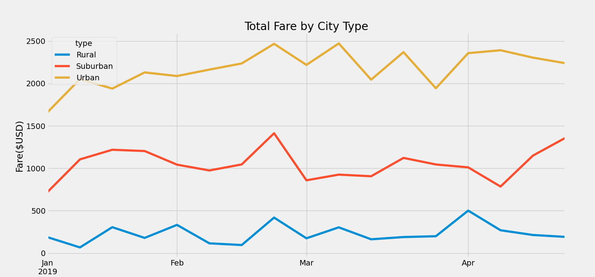

# PyBer Analysis 

## Project Overview 
Analysis of ride sharing data across different city types to determine any seasonal or fare differences. 

## Analysis Process 

###  Data Resources 
- Data Source: Resources/city_data.csv 
- Data Source: Resources/ride_data.csv 

 ### Process 
 1. Create ride sharing summary data by city type 
		- Total Rides   
		- Total Drivers   
		- Total Fares   
		- Average Fare per Ride   
		- Average Fare per Driver   
2. Chart total fares for each city type from 2019-01-01 to 2019-04-29
 
 ### Results
 #### Data Summary Table 
 
 
 #### Total Fare By City Type Chart 

### Summary 
- The average fares per ride increases about 26% from urban to suburban and another  12% between suburban to rural. 
- Urban drivers average the least average fare due to the larger number of drivers. 
- Rural drivers average is significantly higher at 234% over urban and 40% over suburban. 
- There is an increase for all city types total fares around later February. 
- Urban areas have a high point in fares around late February and early March 
- Suburban areas have a hight point in fares around late February and again in late April 

